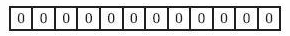
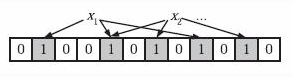
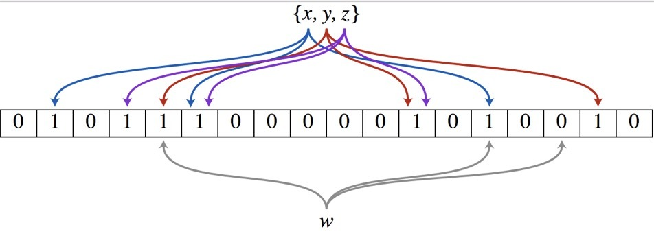
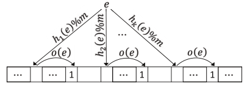
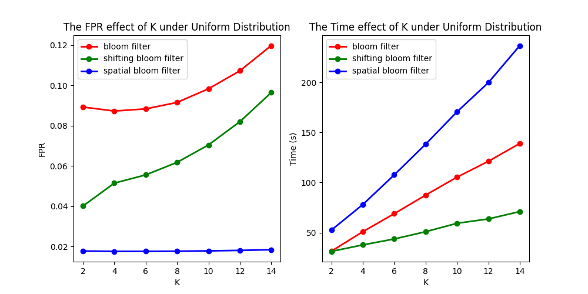
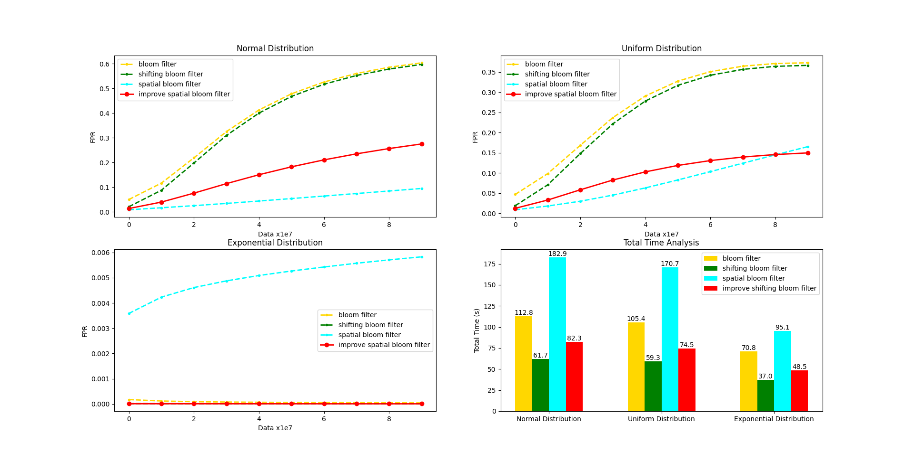

# awesome-bloom-filters

The implement of three kinds of **Bloom Filter**

- Bloom Filter
- Shifting Bloom Filter
- Spatial Bloom Filter

[toc]

# 一、算法简介

## 1.1 Bloom Filter

> Bloom Filter 是由 Bloom 提出的一种多哈希函数映射的快速查找算法。可以快速判断某个元素是否属于集合, 但是并不严格保证返回的结果一定正确。当其返回假时, 那么元素一定不在集合中; 当其返回真时, 元素也有可能在集合中。

**1.构建阶段**

设置一个数组 B 包含 m 位, 初始化所有位都为 0。



设置 k 个哈希函数, 对输入的值 x 进行散列, 并将散列结果与数组容量进行取余, 并设置为 1。即:

$$
B \left [ h_i(x) \% m  \right ] = 1, i=1,2,...,k
$$



**2.查询阶段**

对输入元素 w 的 k 个散列值所在的数组元素取出, 若都为 1 则返回真, 若有一个位置为 0 则返回假。
如图中所示, x,y,z 三个元素存在于集合中, 但是元素 w 所映射的 3 个位置的值中有一个位置为 0, 因此其不在集合中。




## 1.2 Shifting Bloom Filter

> 论文: A Shifting Bloom Filter Framework for Set Queries
> 
> 文中提出的 ShBF 可以适用于三种集合查询方式: 成员查询、关联查询、多重查询。本项目主要实现了成员查询方式, 即判断元素是否存在在集合中。

对于数据集中的元素, 我们需要存储两种信息:
- 存在性信息: 元素是否存在在集合中
- 额外信息: 计数器或者元素所在的集合

**1.构建阶段**

我们设置一个数组 B 包含 m 位, 初始化时所有位为 0。对于元素 e, 通过设置 k 个位置的值为 1 来记录信息。对于这 k 个位置, 我们设置 k/2 个位置存储<u>存在性信息</u>, 设置 k/2 个位置存储<u>额外信息</u>。通过给定偏差的方式, 在记录存在性信息的同时记录额外信息, 偏差定义为如下:

$$
o(.) = h_{\frac{k}{2}+1}(.) \% (\bar{w} - 1) + 1
$$

其中, $h(.)$ 为输出符合均匀分布的哈希函数, $\bar{w}$ 是机器字长 $w$ 的函数, 将在后面介绍取值问题。由于需要在原有数据上进行偏移, 因此数组 B 的长度为 $m + max(offset) = m + o(.) = m + \bar{w}$。

对于元素 e, 我们如图所示设置如下值为 1,:

$$
B \left [ h_1(e) \% m \right ] = B \left [ h_2(e) \% m \right ] = ... = B \left [ h_{\frac{k}{2}}(e) \% m \right ] = \\
B \left [ h_1(e) \% m + o(e) \right ] = B \left [ h_2(e) \% m + o(e) \right ] = ... = B \left [ h_{\frac{k}{2}}(e) \% m + o(e) \right ] = 1
$$



**2.查询阶段**

在构建阶段一共对 k 个位置进行赋值, 因此对于一个元素 e, 计算其在这 k 个位置的值, 如果都为 1, 则该元素在集合中, 否则不在集合中。

**3.参数选择**

我们选择合适的 $\bar{w}$ 参数, 使得可以在一次内存访问操作中, 同时获取 $B \left [ h_i(e) \% m \right ]$ 和 $B \left [ h_i(e) \% 0m + o(e) \right ]$, 因此 $\bar{w} \le w + 1 - j, 1 \le j \le 8$, 选择 $\bar{w} \le w - 7$。

**4.优势**

ShBF 的 FPR 与有 k 个哈希函数的 BF 十分接近, 但是其性能却是 BF 的两倍。因为

- 计算成本减少了一半, 因为哈希函数的数量减少了一半。
- 内存访问次数减少了一半, ShBF 一次获取 2 个 bit, 而 BF 一次获取 1 个 bit。


## 1.3 Spatial Bloom Filter

> 论文: Spatial Bloom Filters: Enabling Privacy in Location-aware Applications
> 
> 文中提出的 SBF 可以用于多集合的查询, 即使用一个数组就可以判断元素是否属于某个集合。

与前两种过滤器不同的地方是, 其存储的信息不再是 1bit 信息, 而是存储元素的区块号或者是优先级号。因此可以携带更多的信息, 但是也带来了更大的空间消耗。

**1.构建阶段**

定义元素所在的区块号集合 $S = \{ \Delta_1, \Delta_2, ..., \Delta_i \}$, 定义哈希函数的集合 $H=\{h_1,h_2,...,h_k\}$, 定义存储标志信息的数组 B 长度为 m, 并且初始化为 0。

对于元素 $x\in \Delta_i$,对于所有的$h \in H$, 设置

$$
\forall h \in H, B\left [ h(x) \%m \right ] = max( B \left [ h(x) \% m \right ], i), x \in \Delta_i
$$

**2.查询阶段**

判断元素 x 是否属于 $\Delta_i$ 必须满足如下两个条件, 任何一个条件不符合都直接返回假: 

1. $\exists h \in H, 使 B \left [ h(x) \% m \right ] = i;$
2. $\forall h \in H, B \left [ h(x) \% m \right ] \ge i;$

如果存在某一个散列地址的值为 0, 则直接返回为假, 因为只有数组初始化时该位置会为 0。

**3.优势**

Spatial Bloom Filter 通过存储更多的信息来记录元素所在的区块, 并且通过只记录高优先级区块的标号的方式进行高容错率存储。因此, 其可以带来高可靠高可用。但是也因此需要更多的空间存储, 查询效率更低。


# 二、数据集介绍

这里使用了三种数据集, 包括: 高斯分布、均匀分布、指数分布。通过使用 C++ 的 random 库下的随机数引擎和随机数分布函数的方式生成不同分布的数据集, 这里每一个数据集总共有 1e8 行的数据。平均文件大小在 1GB 左右。

数据集生成步骤:

1. 定义随机数生成引擎, 并设置随机数种子

```c++
default_random_engine generator(2022);
```

2. 设置不同的随机数分布函数

```c++
// 高斯分布, 设置平均值为 0, 方差为 1 的高斯分布也就是标准正态分布
normal_distribution<double> dist_normal(0, 1.0);
// 均匀分布, 设置最小值为 0, 最大值为 10 的均匀分布
uniform_real_distribution<double> dist_uniform(0, 10);
// 指数分布, 设置平均值为 100 的指数分布
exponential_distribution<double> dist_exp(100);
```

3. 数据分布图如下, 由图可知, 生成的数据集均符合要求的分布


# 三、性能分析

对这里实现的三种不同的布隆过滤器在三种不同分布的数据集上进行实验, 统计各自的 FPR 以及时间。如果不做额外的说明, 那么默认设置使用的 Hash 函数的个数为 10, 设置过滤器中存储标志信息的数组长度为 1e8。因为考虑到内存的限制, 设置太长的数组长度, 将导致内存严重不足。

## 3.1 不同数据集的性能分析

将三种过滤器在三个数据集上进行全量实验, 我们发现随着数据量的上升, 模型的误判率也在急速的提高, 特别是 Bloom Filter 和 Shifting Bloom Filter。因为他们在存储标志信息时, 只会存储 1bit 信息, 当数据量上升时, Hash冲突也会变得严重起来。而 Spatial Bloom Filter 记录的是分区号, 只要 Hash 索引到的所有位置的数据都大于等于并且存在等于当前数据的分区号时, 就判断该数据存在。因此该过滤器的容错能力比较高。但同样, 较高的容错能力带来的是高内存消耗和低运算速度。从`Total Time Analysis`图中可以看出, Spatial Bloom Filter 的时间消耗要远远大于前两者。

Spatial Bloom Filter 同样在极端数据比如机制分布的数据下(因为存在大量的数据重复), 表现的准确度却不如前两种过滤器。因为数据的不断写入与查询, 导致数据的所有 Hash 索引位置都被其他值覆盖, 然后过不了多久该值又被查询, 出现了类似于内存调度中的"抖动"问题。

Shifting Bloom Filter 在准确度上比 Bloom Filter 略高, 但是却节省了大量的时间, 因为其只使用了一半的 Hash 方法, 并且通过一次内存读取读取两个标志信息的方法, 大大缩短了查询和插入时间。


## 3.2 不同 Hash 函数个数的性能分析

我们选择了不同 Hash 函数的个数, 来验证其对过滤器性能的影响。

对于 Bloom Filter 来说, 随着 Hash 函数个数的上升, 其 FPR 先下降后上升。当存储空间足够的时候, 通过增加 Hash 函数的个数可以提高容错率, 但是当空间不足时, 出现了较高的碰撞率, 因此过滤器的误判率也在上升。

而对于 Spatial Bloom Filter 来说, 其本身就具有很强的容错性, Hash 函数个数的提升所带来的影响不是很明显。

通过右侧的时间分析也能看出, 随着 Hash 函数个数的增加, 过滤器的性能也在下降花费的时间在上升。但是,总体来说符合如下的公式:

$$
T_{Spatial Bloom Filter} > T_{Bloom Filter} > T_{Shifting Bloom Filter}
$$
$$
FPR_{Bloom Filter} > FPR_{Shifting Bloom Filter} > FPR_{Spatial Bloom Filter}
$$




# 四、算法改进

这里对 Shifting Bloom Filter 算法进行改进, 我们发现该算法虽然计算速度很快, 但是所带来的准确率并没有很大提升, 与原本的 Bloom Filter 相近。因此, 我们通过增加一个比特数组额外记录元素标志性息的方式来提高准确率, 即设置

$$
B \letf [ h_{\frac{k}{2} + 1 }(x) \% m \right ] = 1
$$

```c++
bits_bak[Hash(key, (k_ >> 1) + 1 - 1) % FILTER_SIZE_SHBF] = 1;
```

我们进行了第三节的实验, 得出如下的实验结果: 



图中所有的红色曲线代表的是我们改进的算法, 其在三种分布的数据集上均有较大的 FPR 改善, 其准确率已经近似 Spatial Bloom Filter 的效果。并且在时间上依旧比 Bloom Filter 有较大的减少, 与原来的 Shifting Bloom Filter 相比只有小幅的上升。


# 五、快速开始

1. 编译项目: 进入 build 目录使用 cmake 编译项目, 并在 bin 目录下生成应用程序

```shell
cd ./build
cmake .. && make
```

2. 生成数据集: 进入 datasets 目录, 直接编译和运行以生成三种不同分布的数据集

```shell
cd ./datasets
g++ prepare.cc -std=c++17 -o prepare
./prepare
```

3. 运行: 运行 main 程序, 以获取三种模型在三种不同分布的数据集上的表现结果

```shell
cd ./bin
./main
```

4. 查看数据集分布图(optional): 进入 log 目录, 运行代码以查看数据分布图以及模型的性能分析图

```shell
cd ./log
# 查看数据分布
python draw_data.py
# 查看模型性能分析
python draw_test.py
```